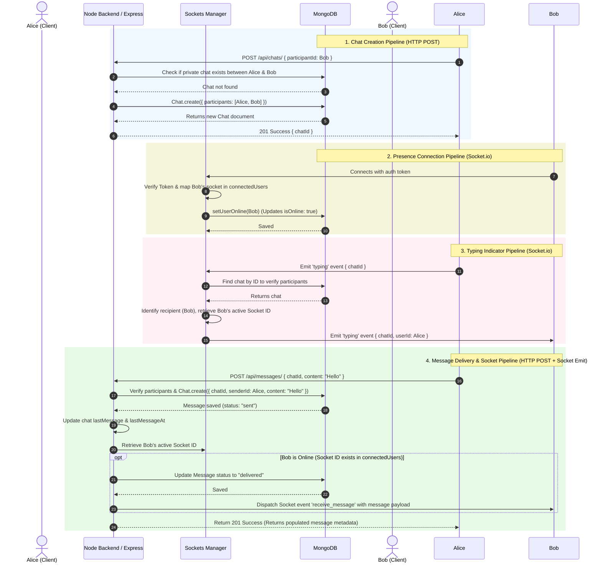

# BACKEND ARCHITECTURE & PIPELINE ANALYSIS

This document provides a detailed breakdown of the backend system of the Realtime Chat Application. It outlines the codebase structure, directory hierarchies, architectural patterns, data models, logic flow within key API modules—especially the **Chats Module (referenced as the "cat module")**—and the real-time pipeline established via WebSockets (Socket.io).

---

## 1. Directory Structure

The backend source code is organized into a modular structure where each functional domain (authentication, user profile, chat rooms, and messages) is self-contained with its own routing, validation, controller, and service layers.

```
backend/
├── src/
│   ├── configs/
│   │   └── redis.config.js
│   ├── database/
│   │   └── db.js
│   ├── middlewares/
│   │   └── auth.middlewares.js
│   ├── models/
│   │   ├── chat.model.js
│   │   ├── message.model.js
│   │   └── user.model.js
│   ├── modules/
│   │   ├── auth/
│   │   │   ├── index.js
│   │   │   ├── login/
│   │   │   │   ├── login.controller.js
│   │   │   │   ├── login.route.js
│   │   │   │   ├── login.service.js
│   │   │   │   └── login.validation.js
│   │   │   ├── logout/
│   │   │   │   ├── logout.controller.js
│   │   │   │   ├── logout.route.js
│   │   │   │   └── logout.service.js
│   │   │   ├── refresh-token/
│   │   │   │   ├── refresh-token.controller.js
│   │   │   │   ├── refresh-token.route.js
│   │   │   │   ├── refresh-token.service.js
│   │   │   │   └── refresh-token.validation.js
│   │   │   └── register/
│   │   │       ├── register.controller.js
│   │   │       ├── register.route.js
│   │   │       ├── register.service.js
│   │   │       └── register.validation.js
│   │   ├── chats/
│   │   │   ├── index.js
│   │   │   ├── create-chat/
│   │   │   │   ├── create-chat.controller.js
│   │   │   │   ├── create-chat.route.js
│   │   │   │   ├── create-chat.service.js
│   │   │   │   └── create-chat.validation.js
│   │   │   ├── delete-chat/
│   │   │   │   ├── delete-chat.controller.js
│   │   │   │   ├── delete-chat.route.js
│   │   │   │   └── delete-chat.service.js
│   │   │   ├── get-chat/
│   │   │   │   ├── get-chat.controller.js
│   │   │   │   ├── get-chat.route.js
│   │   │   │   └── get-chat.service.js
│   │   │   └── get-chats/
│   │   │       ├── get-chats.controller.js
│   │   │       ├── get-chats.route.js
│   │   │       └── get-chats.service.js
│   │   ├── messages/
│   │   │   ├── index.js
│   │   │   ├── delete-message/
│   │   │   │   ├── delete-message.controller.js
│   │   │   │   ├── delete-message.route.js
│   │   │   │   └── delete-message.service.js
│   │   │   ├── get-messages/
│   │   │   │   ├── get-messages.controller.js
│   │   │   │   ├── get-messages.route.js
│   │   │   │   └── get-messages.service.js
│   │   │   └── send-message/
│   │   │       ├── send-message.controller.js
│   │   │       ├── send-message.route.js
│   │   │       ├── send-message.service.js
│   │   │       └── send-message.validation.js
│   │   └── users/
│   │       ├── index.js
│   │       ├── get-user/
│   │       │   ├── get-user.controller.js
│   │       │   ├── get-user.route.js
│   │       │   └── get-user.service.js
│   │       ├── profile/
│   │       │   ├── profile.controller.js
│   │       │   ├── profile.route.js
│   │       │   └── profile.service.js
│   │       ├── search-users/
│   │       │   ├── search-users.controller.js
│   │       │   ├── search-users.route.js
│   │       │   └── search-users.service.js
│   │       └── update-profile/
│   │           ├── update-profile-controller.js
│   │           ├── update-profile-route.js
│   │           ├── update-profile-service.js
│   │           └── update-profile-validation.js
│   ├── sockets/
│   │   ├── connected-users.js
│   │   ├── socket.event.js
│   │   ├── socket.handlers.js
│   │   ├── socket.middleware.js
│   │   ├── socket.presence.js
│   │   ├── socket.read-receipt.js
│   │   ├── socket.server.js
│   │   ├── socket.typing.js
│   │   └── socket.utils.js
│   ├── utils/
│   │   └── token.utils.js
│   ├── app.js
│   └── server.js
├── .env
├── package.json
└── package-lock.json
```

---

## 2. Global Configurations & Initializers

### 2.1 Server Bootstrapping
- [server.js](file:///C:/Users/LENOVO/Desktop/realtime-chat/backend/src/server.js): The entry point of the application. It loads environment configuration (`dotenv`), connects to the MongoDB database, wraps the Express application with an HTTP Server to support WebSockets, initializes the Socket.io server, and listens on the configured `PORT`.
- [app.js](file:///C:/Users/LENOVO/Desktop/realtime-chat/backend/src/app.js): Configures the Express app with essential middlewares (`express.json()`, `cors()`, `helmet()` for headers security, and `morgan()` for request logging) and mounts the API routes at their respective namespaces:
  - `/api/auth` -> Mounted with the Auth module router.
  - `/api/users` -> Mounted with the User module router.
  - `/api/chats` -> Mounted with the Chat module router.
  - `/api/messages` -> Mounted with the Message module router.

### 2.2 Database & Cache Connections
- [db.js](file:///C:/Users/LENOVO/Desktop/realtime-chat/backend/src/database/db.js): Integrates Mongoose to establish a connection with MongoDB using `MONGO_URI`. If the connection fails, it outputs the error and terminates the node process (`process.exit(1)`).
- [redis.config.js](file:///C:/Users/LENOVO/Desktop/realtime-chat/backend/src/configs/redis.config.js): Configures an `ioredis` client connection using `REDIS_URL`. Redis is utilized as a fast in-memory key-value store primarily for managing/whitelisting active user refresh tokens to support session validation and instant revocation.

### 2.3 Authentication Middleware
- [auth.middlewares.js](file:///C:/Users/LENOVO/Desktop/realtime-chat/backend/src/middlewares/auth.middlewares.js): Intercepts incoming HTTP requests destined for protected endpoints. It extracts the JSON Web Token from the `Authorization` header (`Bearer <token>`), validates it against the `JWT_SECRET`, decodes the payload to extract `userId`, and checks MongoDB for a matching User. The user object is fetched (excluding password field) and attached as `req.user`, allowing downstream controllers to retrieve the caller's context.

---

## 3. Data Models

The database structure relies on three Mongoose schemas representing the core entities of the application.

### 3.1 User Model
Defined in [user.model.js](file:///C:/Users/LENOVO/Desktop/realtime-chat/backend/src/models/user.model.js):
- **Fields**:
  - `username` (String, required, length $3-30$ characters)
  - `email` (String, required, unique, lowercase)
  - `password` (String, required)
  - `profilePicture` (String, default empty)
  - `bio` (String, default empty)
  - `isOnline` (Boolean, default `false`)
  - `lastSeen` (Date, default `null`)
- **Timestamps**: Automatically managed `createdAt` and `updatedAt`.

### 3.2 Chat Model
Defined in [chat.model.js](file:///C:/Users/LENOVO/Desktop/realtime-chat/backend/src/models/chat.model.js):
- **Fields**:
  - `participants`: Array of references to the `User` model.
  - `chatType`: String, supports `private` (1-to-1) or `group` chats (defaults to `private`).
  - `lastMessage`: Reference to the `Message` model, storing the most recent message in the chat.
  - `lastMessageAt`: Date of the most recent message.
- **Indices**: A compound index is defined on `participants: 1` to optimize chat queries.
- **Timestamps**: Automatically managed `createdAt` and `updatedAt`.

### 3.3 Message Model
Defined in [message.model.js](file:///C:/Users/LENOVO/Desktop/realtime-chat/backend/src/models/message.model.js):
- **Fields**:
  - `chatId`: Reference to the `Chat` model (required).
  - `senderId`: Reference to the `User` model (required).
  - `content`: String (required, trimmed).
  - `messageType`: String, enum: `["text", "image", "file"]`, defaults to `text`.
  - `status`: String, enum: `["sent", "delivered", "read"]`, defaults to `sent`.
- **Indices**: A compound index is defined on `{ chatId: 1, createdAt: -1 }` to fetch the chat log chronologically with maximum efficiency.
- **Timestamps**: Automatically managed `createdAt` and `updatedAt`.

---

## 4. API Modules (MVC / Service Pattern)

Each module follows a structured architecture separating concerns:
1. **Route (`*.route.js`)**: Registers endpoints, attaches validators and route guards, and points to the controller.
2. **Validator (`*.validation.js`)**: Formulates checks using `express-validator` to ensure fields are valid before reaching business logic.
3. **Controller (`*.controller.js`)**: Checks validation errors, extracts data from request, invokes the service layer, and sends HTTP responses.
4. **Service (`*.service.js`)**: Implements Mongoose queries, updates schemas, or coordinates with Redis.

### 4.1 Authentication Module
Managed under [index.js](file:///C:/Users/LENOVO/Desktop/realtime-chat/backend/src/modules/auth/index.js):
- **Register**: Validates email/username and hashes password with `bcryptjs` before inserting a new user.
- **Login**: Compares password, issues Access Token (15m) & Refresh Token (7d), and writes the Refresh Token to Redis at the key `refresh:${userId}`.
- **Logout**: Clears the session refresh token from Redis.
- **Refresh Token**: Verifies the signature of the incoming Refresh Token, ensures it exists in Redis, and issues a new Access Token.

---

### 4.2 Chats Module (The "Cat" Module)
The Chats module organizes direct communication sessions between participants. It mounts at `/api/chats` under [index.js](file:///C:/Users/LENOVO/Desktop/realtime-chat/backend/src/modules/chats/index.js).

#### 4.2.1 Create Chat Flow
- **Route**: [create-chat.route.js](file:///C:/Users/LENOVO/Desktop/realtime-chat/backend/src/modules/chats/create-chat/create-chat.route.js) -> `POST /api/chats/`
- **Validation**: [create-chat.validation.js](file:///C:/Users/LENOVO/Desktop/realtime-chat/backend/src/modules/chats/create-chat/create-chat.validation.js) requires `participantId` to be a valid MongoDB ObjectId.
- **Controller**: [create-chat.controller.js](file:///C:/Users/LENOVO/Desktop/realtime-chat/backend/src/modules/chats/create-chat/create-chat.controller.js) unpacks the request payload and calls the service.
- **Service**: [create-chat.service.js](file:///C:/Users/LENOVO/Desktop/realtime-chat/backend/src/modules/chats/create-chat/create-chat.service.js)
  - Checks if `currentUserId` is identical to `participantId`. If so, aborts execution ("You cannot create a chat with yourself").
  - Verifies the target user exists in MongoDB.
  - Queries MongoDB to check if a private chat already exists between these two participants (`participants: { $all: [currentUserId, participantId] }`).
  - If a chat already exists, returns the existing record to prevent duplicate rooms.
  - If no chat exists, creates and returns a new Chat document.

#### 4.2.2 Delete Chat Flow
- **Route**: [delete-chat.route.js](file:///C:/Users/LENOVO/Desktop/realtime-chat/backend/src/modules/chats/delete-chat/delete-chat.route.js) -> `DELETE /api/chats/:chatId`
- **Controller**: [delete-chat.controller.js](file:///C:/Users/LENOVO/Desktop/realtime-chat/backend/src/modules/chats/delete-chat/delete-chat.controller.js)
- **Service**: [delete-chat.service.js](file:///C:/Users/LENOVO/Desktop/realtime-chat/backend/src/modules/chats/delete-chat/delete-chat.service.js)
  - Locates the Chat document by ID.
  - Verifies that the deleting user is an active participant in that chat. If not, throws "Access denied".
  - Performs a cascade deletion by removing all Messages linked to the chat (`Message.deleteMany({ chatId })`).
  - Deletes the Chat document and returns success.

#### 4.2.3 Get Chat Details Flow
- **Route**: [get-chat.route.js](file:///C:/Users/LENOVO/Desktop/realtime-chat/backend/src/modules/chats/get-chat/get-chat.route.js) -> `GET /api/chats/:chatId`
- **Controller**: [get-chat.controller.js](file:///C:/Users/LENOVO/Desktop/realtime-chat/backend/src/modules/chats/get-chat/get-chat.controller.js)
- **Service**: [get-chat.service.js](file:///C:/Users/LENOVO/Desktop/realtime-chat/backend/src/modules/chats/get-chat/get-chat.service.js)
  - Retrieves the chat document, populating `participants` (`_id username profilePicture isOnline`) and `lastMessage`.
  - Confirms the authenticated user is listed in the `participants` array. Otherwise, throws "Access denied".

#### 4.2.4 Get All Chats Flow
- **Route**: [get-chats.route.js](file:///C:/Users/LENOVO/Desktop/realtime-chat/backend/src/modules/chats/get-chats/get-chats.route.js) -> `GET /api/chats/`
- **Controller**: [get-chats.controller.js](file:///C:/Users/LENOVO/Desktop/realtime-chat/backend/src/modules/chats/get-chats/get-chats.controller.js)
- **Service**: [get-chats.service.js](file:///C:/Users/LENOVO/Desktop/realtime-chat/backend/src/modules/chats/get-chats/get-chats.service.js)
  - Queries MongoDB for all Chat documents that contain `req.user._id` in the `participants` array.
  - Populates the profiles of the participants and references to the `lastMessage` details.
  - Sorts the results in descending order by `updatedAt` so chats with recent activity appear first.

---

### 4.3 Messages Module
Handles message logs and is mounted at `/api/messages` under [index.js](file:///C:/Users/LENOVO/Desktop/realtime-chat/backend/src/modules/messages/index.js).

#### 4.3.1 Send Message Flow
- **Route**: [send-message.route.js](file:///C:/Users/LENOVO/Desktop/realtime-chat/backend/src/modules/messages/send-message/send-message.route.js) -> `POST /api/messages/`
- **Validation**: [send-message.validation.js](file:///C:/Users/LENOVO/Desktop/realtime-chat/backend/src/modules/messages/send-message/send-message.validation.js) verifies `chatId` is a Mongo ID and `content` is not empty.
- **Controller**: [send-message.controller.js](file:///C:/Users/LENOVO/Desktop/realtime-chat/backend/src/modules/messages/send-message/send-message.controller.js)
- **Service**: [send-message.service.js](file:///C:/Users/LENOVO/Desktop/realtime-chat/backend/src/modules/messages/send-message/send-message.service.js)
  - Fetches the target Chat and populates its participants.
  - Verifies the sender belongs to the chat.
  - Creates the new Message document (default status: `sent`).
  - Updates the corresponding Chat's `lastMessage` and `lastMessageAt` reference to point to the new message, and calls `save()`.
  - **Delivery Check**: Finds the recipient user ID from the chat's participants. If the recipient has an active Socket ID mapped in `connectedUsers`:
    - Changes the message status to `delivered`.
    - Saves the Message document.
  - Populates `senderId` (`_id username profilePicture`).
  - **Realtime Dispatch**: If the recipient's socket mapping is active, calls Socket.io to emit the `receive_message` event containing the populated message payload.
  - Returns the message to the sender.

#### 4.3.2 Get Messages Flow
- **Route**: [get-messages.route.js](file:///C:/Users/LENOVO/Desktop/realtime-chat/backend/src/modules/messages/get-messages/get-messages.route.js) -> `GET /api/messages/:chatId`
- **Controller**: [get-messages.controller.js](file:///C:/Users/LENOVO/Desktop/realtime-chat/backend/src/modules/messages/get-messages/get-messages.route.js)
- **Service**: [get-messages.service.js](file:///C:/Users/LENOVO/Desktop/realtime-chat/backend/src/modules/messages/get-messages/get-messages.service.js)
  - Validates `chatId`.
  - Asserts that the requester is a participant of the chat room.
  - Retrieves up to 50 messages, sorted in ascending chronological order (`createdAt: 1`) to render the chat history, populating the senders' user profiles.

#### 4.3.3 Delete Message Flow
- **Route**: [delete-message.route.js](file:///C:/Users/LENOVO/Desktop/realtime-chat/backend/src/modules/messages/delete-message/delete-message.route.js) -> `DELETE /api/messages/:messageId`
- **Service**: [delete-message.service.js](file:///C:/Users/LENOVO/Desktop/realtime-chat/backend/src/modules/messages/delete-message/delete-message.service.js)
  - Finds the message by ID.
  - Checks if the authenticated user is the sender of the message. If not, throws "Access denied".
  - Deletes the message from the collection.

---

### 4.4 Users Module
Manages profile edits, lookup, and search functionality under [index.js](file:///C:/Users/LENOVO/Desktop/realtime-chat/backend/src/modules/users/index.js).

- **Profile**: [profile.route.js](file:///C:/Users/LENOVO/Desktop/realtime-chat/backend/src/modules/users/profile/profile.route.js) retrieves the requester's user profile (attached by `authMiddleware`).
- **Update Profile**: [update-profile-route.js](file:///C:/Users/LENOVO/Desktop/realtime-chat/backend/src/modules/users/update-profile/update-profile-route.js) validates and updates user fields (username, profilePicture, bio) in the database via `User.findByIdAndUpdate` inside [update-profile-service.js](file:///C:/Users/LENOVO/Desktop/realtime-chat/backend/src/modules/users/update-profile/update-profile-service.js).
- **Search Users**: [search-users.route.js](file:///C:/Users/LENOVO/Desktop/realtime-chat/backend/src/modules/users/search-users/search-users.route.js) executes a case-insensitive regex query on usernames, filtering out the current user profile, and limits output to 20 users.
- **Get User Profile**: [get-user.route.js](file:///C:/Users/LENOVO/Desktop/realtime-chat/backend/src/modules/users/get-user/get-user.route.js) fetches public details (bio, profile picture, online/offline status, last seen time) of a target user by ID.

---

## 5. Realtime Socket Pipeline (WebSockets)

Socket.io configuration handles real-time capabilities including messaging, presence tracking, typing indicators, and read receipts.

### 5.1 Socket Architecture Files

- [socket.server.js](file:///C:/Users/LENOVO/Desktop/realtime-chat/backend/src/sockets/socket.server.js): Initializes a new Socket.io `Server` using the HTTP listener. It applies the connection middleware `socketAuthMiddleware` and sets up the primary handlers using `registerSocketHandlers`.
- [socket.middleware.js](file:///C:/Users/LENOVO/Desktop/realtime-chat/backend/src/sockets/socket.middleware.js): Validates connection requests by reading the token payload supplied at `socket.handshake.auth.token`. It verifies it against the `JWT_SECRET` and assigns the user's decoded object directly to `socket.user`.
- [connected-users.js](file:///C:/Users/LENOVO/Desktop/realtime-chat/backend/src/sockets/connected-users.js): Exposes a single, in-memory JavaScript `Map` where active socket sessions are tracked: `Map<userId, socketId>`.
- [socket.utils.js](file:///C:/Users/LENOVO/Desktop/realtime-chat/backend/src/sockets/socket.utils.js): Exposes a lookup utility `getUserSocketId(userId)` to obtain the active connection socket ID for any user from the `connectedUsers` map.
- [socket.event.js](file:///C:/Users/LENOVO/Desktop/realtime-chat/backend/src/sockets/socket.event.js): Centralizes the constants for socket event strings.

### 5.2 Presence & Lifecycle Pipelines
Managed within [socket.handlers.js](file:///C:/Users/LENOVO/Desktop/realtime-chat/backend/src/sockets/socket.handlers.js):
1. **Connection**:
   - The user connects and passes their authorization token.
   - The user's ID is retrieved from the socket handshake.
   - The socket maps the user in the connection map: `connectedUsers.set(userId, socket.id)`.
   - The database state is updated to online using `setUserOnline(userId)` in [socket.presence.js](file:///C:/Users/LENOVO/Desktop/realtime-chat/backend/src/sockets/socket.presence.js).
2. **Disconnection**:
   - The client disconnects, triggering `disconnect`.
   - The database status is updated: `isOnline` is set to `false`, and `lastSeen` is set to the current date and time via `setUserOffline(userId)` in [socket.presence.js](file:///C:/Users/LENOVO/Desktop/realtime-chat/backend/src/sockets/socket.presence.js).
   - The user's connection mapping is deleted from the active user registry: `connectedUsers.delete(userId)`.

### 5.3 Typing Indicators Pipeline
- **Events**: `typing` and `stop_typing`
- **Flow**:
  - The client emits `typing` or `stop_typing` with a `{ chatId }`.
  - The socket event handler receives the message and delegates it to `handleTyping` or `handleStopTyping` inside [socket.typing.js](file:///C:/Users/LENOVO/Desktop/realtime-chat/backend/src/sockets/socket.typing.js).
  - The handler fetches the chat room and identifies the recipient participant (the participant whose ID is not the current user).
  - Retrieves the recipient's socket ID from `connectedUsers`.
  - If the socket ID is active, emits `typing` or `stop_typing` event to the recipient with the corresponding `{ chatId, userId }`.

### 5.4 Read Receipts Pipeline
- **Event**: `message_read`
- **Flow**:
  - Client reads a message and emits `message_read` with `{ messageId }`.
  - The socket handler intercepts the event and delegates to `markMessageAsRead` in [socket.read-receipt.js](file:///C:/Users/LENOVO/Desktop/realtime-chat/backend/src/sockets/socket.read-receipt.js).
  - Executes `Message.findByIdAndUpdate` setting the message's `status` to `"read"`.

---

## 6. System Interaction Diagram

This diagram visualizes the interaction flows across the HTTP and Socket layers for creating chats, sending messages, handling typing indicators, and updating presence status.



---

## 7. Flow Summary & Key Architectural Integrations

The backend implements a highly cohesive runtime architecture:
- **HTTP / Socket Synchronization**: When sending a message, the system relies on an **HTTP POST request** for persistence and verification (database validation, authorization checks, Mongoose storage). The **WebSockets (Socket.io) layer** is used as a real-time delivery mechanism to forward the saved database payload to active connections instantly.
- **State Separation**: Permanent data (users, messages, and chat rooms) resides in MongoDB, while temporary connection mappings (`Map<userId, socketId>`) and session revocation details (Refresh Token whitelisting) are kept in memory and Redis for high-speed lookup and validation.
- **Strict Guard Rails**: Every route validates inputs at the door (`express-validator`), verifies access tokens via middleware, and checks room authorization before querying messages or sending payloads. This ensures users only receive updates they are authorized to access.
